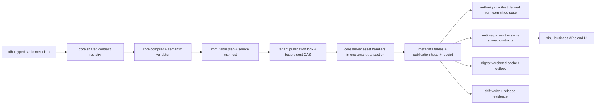
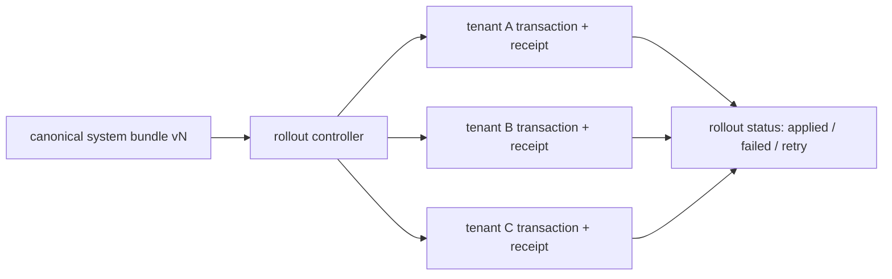

# xihui / core 元数据治理彻底整改实施与验收方案

> 文档状态：可执行修订版，待负责人批准后仅从 Wave 0A 启动
> 制定日期：2026-08-12
> 审查范围：不设时间窗口，覆盖两个仓库当前可达实现、历史治理入口、运行时硬编码、测试与发布证据
> 适用仓库：`/Users/ian/Documents/AI项目/xihui`、`/Users/ian/Documents/core`
> 原则：不按工期压缩范围；每一阶段以依赖、证据和退出门禁推进

---

## 1. 最终结论

本次问题不是若干散点硬编码，而是六条链路没有使用同一权威契约：

1. 静态配置能描述什么；
2. 发布前校验什么；
3. 数据库实际写入什么；
4. 哪些写入口允许修改；
5. 运行时如何解释业务语义；
6. 发布证据究竟绑定哪一份源码和数据库状态。

彻底整改不能重写一套新平台，也不能继续在 xihui 追加补丁。正确路线是：

- 复用已有 `StaticMetadataBundle`、Document Flow runtime、Document Change 并发控制、PageOperation、Application Bundle snapshot/apply、xihui 单事务 publisher、MetadataChangeSet 和 release gate 骨架；
- 把契约、校验、authority、plan、事务 handler、receipt 和 runtime parser 收敛为一条 canonical pipeline；
- 将 xihui 的业务定义保留在 xihui，将跨项目机制迁入 core；
- 先隔离会改凭据、跨租户归属或物理删除数据的危险入口，再做渐进式抽取；
- 用现有真实业务闭环建立 golden invariants，通过 shadow、真实 PostgreSQL、权限、并发、恢复演练和浏览器回归证明语义没有变化；
- 最终执行单写切换并删除旧链路，不保留永久双格式、双 publisher 或兼容分支。

目标链路如下：



跨租户 AI 系统元数据不采用一个覆盖所有租户的长事务，而是每租户原子、上层 rollout 可恢复：



---

## 2. 复审对上一版方案的关键修正

上一版覆盖面较全，但以下设计不能直接实施：

| 上一版倾向 | 复审后的修正 | 原因 |
|---|---|---|
| shared registry 携带数据库 table、authority | registry 分 shared contract 与 server handler 两层 | shared 不应依赖 Prisma、表名或服务端权限策略 |
| 所有 AI tenant 放一个全局事务 | 每 tenant 原子 + rollout 状态机 | 降低锁时长和故障域，并可精确重试 |
| 所有验证都要求 clean worktree | development 绑定 content manifest；release candidate 必须 fresh checkout、clean SHA | 既支持提交前验证，又保证发布证据可复现 |
| 新建 UI action DSL | 强化已有 PageOperation，扩展 list/row/batch surface | core 已有正式 contract 和 detail executor，另建协议会双轨 |
| 新建 Document Change effects DSL | 扩展现有 `documentChangeControl` mapping | 当前需求只是字段映射，泛化 effects interpreter 属于过度设计 |
| Document Flow 从零重建 | 补齐 versioned Zod、语义校验和 runtime parse | runtime、幂等、事务、lineage 和并发测试已经成熟 |
| 全部清理逻辑放 core | core 只提供 digest/CAS/receipt 安全原语；xihui 拥有业务 selector/冲销规则 | 业务数据删除语义不能由通用 metadata core 决定 |
| 所有 route 文本元数据化 | 保留项目 route shell，只迁移状态/权限/执行语义 | 避免为了元数据化而元数据化 |
| 统一使用 SERIALIZABLE | 先引入单租户 writer lock + base digest CAS，再用并发试验证明 isolation 选择 | 不能用最强隔离替代并发设计和证据 |
| 连续 3 个 clean SHA 即可验收 | 同一 RC 做确定性重放、空库发布、生产快照升级/恢复三类证明 | 多个不同 SHA 通过并不能证明确定性或可恢复性 |
| handler 使用 kind 级单一 authority | authority 按 asset identity + publication source 计算并固化到 committed projection | PageConfig 等同一 kind 需要 Git/runtime 混合 authority |
| absent manifest 默认 runtime-managed | 从未 enrollment 才 runtime-managed；已 enrollment 但 manifest 缺失/非法必须 fail closed | 防止误删 manifest 后静默解锁受管写入 |
| PageOperation 保留任意 API/command 字符串 | 元数据只引用 registered action/route code，服务端重新加载定义并执行 | 严格 schema 不能代替服务端权限和命令白名单 |
| 项目自定义“只读”验证命令 | project 只交付 policy facts；validator 必须是 core 注册纯函数 | shell/process 无法仅靠声明阻止读取 `.env`、连库或写文件 |
| reviewer 独立性由 JSON 布尔字段声明 | RC 绑定 CI/PR principal 或可验签名 attestation | 实现者不能自行生成信任根 |
| PrintTemplate drop 后仍承诺普通 down migration | drop 前保留回滚窗口；drop 后进入 forward-only + restore/roll-forward 阶段 | 新 `documentKind` 可能无法表示为旧 enum |

---

## 3. 范围、非目标与硬约束

### 3.1 本次范围

- canonical metadata schema、版本、identity、dependency 和扩展边界；
- xihui bundle/validate/apply/verify/release 的通用机制归属；
- PageConfig、Role Policy、Document Flow、Document Change、PageOperation、PrintTemplate、AI system metadata；
- authority、租户隔离、事务、并发、cache consistency、receipt、drift 和 rollback；
- xihui/core 的客户边界、运行时字段猜测和不可达 legacy surface；
- destructive operation、retired metadata migration 和本地启动脚本；
- 模块体积、测试夹具、独立复核和 release evidence。

### 3.2 明确非目标

以下事项仍是产品或上线待办，不能因治理整改完成而宣称完成：

- 销售退货、红字出库、补发等退补货实物流；
- 正式会计科目映射和最终过账；
- 高阶经营驾驶舱和跨报表联动；
- 供应商评级公式、周期和准交率口径；
- 客户最终打印版式确认；
- 客户真实期初数据、生产硬件/网络参数和正式恢复演练。

本方案不重做已跑通的业务流程，不顺手增加业务能力，不授权生产数据写入。

### 3.3 不可违反的约束

- 通用能力进 core；xihui 只保留业务静态配置、项目 policy facts 和业务验收；
- 不新增项目专属 core 分支，不永久兼容历史格式，不静默兜底；
- 不使用 `any`，不降低类型/租户/权限门禁；
- 不手改 `dist`；
- 不使用 dual write 作为长期架构。数据库 expand/contract 如必须短期双写，必须有监控、退出 gate 和紧接的删除 PR；
- 解析失败、未知 action/operator/asset kind、无 tenant、非法 authority manifest 必须 fail closed；
- metadata 发布不创建或重置用户凭据，不迁移用户到其他 tenant；
- metadata 发布不创建 tenant、SystemConfig、User、UserRole 或未进入 canonical `RolePolicy` 的 Role；这些前置对象必须由独立 bootstrap/IAM 流程提供；
- 生产财务、库存、履约数据不允许通过通用 clear 脚本物理删除；
- 高风险 PR 合并前必须由不同模型或独立会话复核实现和测试证据；
- 每个阶段失败即停止，不以“后续再补证据”进入下一阶段。

---

## 4. 复审后的问题清单与优先级

### 4.1 S0：立即隔离，不等待新架构

| ID | 事实 | 风险 | 目标状态 |
|---|---|---|---|
| S0-01 | metadata transaction 调用 `ensureSystemUser`，每次重新 bcrypt 并更新 password，按全局 email upsert 还可能改变 tenantId | 凭据重置、跨租户归属 | 用户/密码只由 secure tenant bootstrap 管理；metadata publish 永不写 User/UserRole |
| S0-02 | roles 每次 publish 被覆盖，却不在 Bundle/receipt/authority manifest | 隐形 Git-managed asset、runtime 修改被静默覆盖 | role policy 成为显式 canonical asset；用户角色分配走独立 IAM 流程 |
| S0-03 | `migrateLegacyWorkflowPermissions` 每次 publish 重跑 | 永久历史兼容、不可证明变更 | 一次性 versioned migration，完成后删除 runtime migration |
| S0-04 | `clear-xihui-*` 和 retired metadata migration 能物理删除业务/metadata records | 财务库存损坏、宽泛 selector | 立即 quarantine execute；后续只允许受控 migration/reset |
| S0-05 | core 根目录保留直接改 idea 项目的 `.js/.sh` 脚本，boundary gate 漏扫这些扩展名 | core 客户边界被绕过 | 禁用/迁出客户脚本，扩大 gate 扫描范围 |
| S0-06 | xihui customer example 被合并进 production `getOfficialBusinessTemplates()` | 客户专属 pack 暴露为 official | production catalog 只返回 official packs，已安装 code 先审计迁移 |

### 4.2 S1：发布与 authority 正确性

| ID | 事实 | 目标状态 |
|---|---|---|
| S1-01 | PageConfig 在 Bundle/plan 中，但不在 authority asset union，独立于项目 transaction 发布 | 与其他 metadata 同 plan、同 tenant transaction、同 receipt |
| S1-02 | PageConfig 写入口包括 controller、dashboard、Application Bundle、business package 等 | 所有写入经过受管 identity repository guard；canonical publisher 使用内部 capability |
| S1-03 | PageConfig default sibling 清理与 create/update 不是同一 transaction | 单次 mutation 原子，数据库唯一约束/并发测试保证一个 default |
| S1-04 | authority manifest 手工列举，parser 接受未知 key；route coverage 手工枚举 | manifest versioned strict parse；mutation surface 注册即分类；handler completeness 可计算 |
| S1-05 | xihui publisher 与独立 PageConfig publisher 两阶段 | 外部只存在一个 project apply 入口，后一步失败不会留下前一步提交 |
| S1-06 | receipt 以文件为主且 PageConfig 文件在 DB commit 后 rename | DB receipt 与 head 在 transaction 内；文件只是可再生导出 |
| S1-07 | metadata receipt 使用全局 `Setting.key`，不是正式 tenant-scoped publication model | tenant/channel scoped immutable receipt 与 current head |
| S1-08 | cache invalidation 在 commit 后 best effort | cache key 绑定 committed content digest；必要副作用通过 outbox 重试 |

### 4.3 S1：契约和运行时一致性

| ID | 事实 | 目标状态 |
|---|---|---|
| S1-09 | `documentFlows` 是 `record<string, unknown>`，runtime 只检查 3 个字符串即 cast | shared versioned Zod 在 bundle 和 runtime load 两处使用 |
| S1-10 | Document Change 写死 after/proposed 字段映射 | 映射进入现有 `documentChangeControl` policy，runtime 不含 xihui 字段名 |
| S1-11 | PageOperation 已存在但 operator 任意字符串，client 弱 type guard，未知 operator 退回 `==` | shared strict operator union + canonical evaluator；未知值阻断 |
| S1-12 | `EnhancedEntityList.vue` 写死状态、动作、权限、command 和路由 | list/row/batch 使用 PageOperation executor；项目 route shell 可保留 |
| S1-13 | client/reference 与 report resolver 各维护一份 target/display 字段猜测 | 以 Field relation + Entity display metadata 为准，移除业务字段名 fallback |
| S1-14 | fixed DocumentTransform UI 请求不存在的 server endpoint；WorkflowStateManager 仅 export/test 且 unknown fail-open | 下游依赖审计后退役，或适配正式 Document Flow/StateMachine；不得继续双轨 |

### 4.4 S2：独立迁移与工程质量

| ID | 事实 | 目标状态 |
|---|---|---|
| S2-01 | AI entities/forms 分散 seed，tenant 内无 transaction，测试主要是 mock | canonical system bundle；每 tenant plan/transaction/receipt；rollout 可重试 |
| S2-02 | AI session relation targetField 与实际 record ID 语义不符，controller 有 7 个 validation bypass，JSON 双格式 | 修正 relation，补 command Zod/partial validation，一次性 JSON migration 后删除 AI bypass |
| S2-03 | PrintTemplate type 固定在 Zod、Prisma enum、两套 shared type、client catalog 和 xihui publisher特判 | 独立 expand/contract 为开放 `documentKind` + catalog/categoryBinding |
| S2-04 | xihui validate 1,873 行、seed 14,529 行、verify 15,009 行 | 按 domain/handler/scenario 拆分，CLI 只编排；加入 xihui module-size gate |
| S2-05 | config 允许任意 shell command，freshness 使用 mtime，release gate 记录 dirty 但未全面阻断 | 固定 lifecycle config；content source manifest；development/RC 两种模式 |
| S2-06 | 近期 commit 的 AI/risk/validation/reviewer 字段覆盖率低 | 未来 release 强制结构化 evidence；不改历史提交 |
| S2-07 | `start-dev.sh` 写死本机环境并自动移动 stale PostgreSQL pid | 独立运维整改：默认诊断，显式 `--repair`，local config 不提交 |

---

## 5. 目标职责边界

### 5.1 `core/packages/shared`：纯契约层

shared registry 只包含：

```ts
type CanonicalAssetIdentity<TKind extends string = string> = `${TKind}:${string}`

interface CanonicalAssetContract<TKind extends string, TValue> {
  kind: TKind
  schemaVersion: number
  schema: ZodType<TValue>
  identity: (value: TValue) => CanonicalAssetIdentity<TKind>
  kindDependencies: readonly CanonicalAssetKind[]
  valueDependencies: (value: TValue) => readonly CanonicalAssetIdentity[]
}
```

shared 不包含数据库表、Prisma delegate、transaction、authority policy、route 或 tenant storage 策略。

`kindDependencies` 只用于 handler 稳定排序；`valueDependencies` 表示具体 asset 引用，用于缺失引用、identity 冲突和 cycle 校验。两者不允许共用一个含糊的 `string[]` 字段。

registry 首期是 core 内闭集，不设计任意 runtime plugin。为避免 TypeScript 动态组装导致类型退化，允许显式 Zod object + `satisfies` + exhaustiveness tests，不追求“一个动态 Map 自动生成所有类型”的炫技实现。

### 5.2 `core/packages/server`：持久化与治理层

server registry 对每个可持久化资产声明：

```ts
interface AuthorityDecision {
  mode: 'git-managed' | 'runtime-managed' | 'system-managed'
  sourceOwner: string | null
}

interface CanonicalAssetHandler<TKind extends CanonicalAssetKind, TValue> {
  kind: TKind
  authorityFor(
    identity: CanonicalAssetIdentity<TKind>,
    context: AuthorityContext,
  ): AuthorityDecision
  snapshot(tx: MetadataTransactionClient, scope: TenantScope): Promise<NormalizedAsset[]>
  plan(
    input: readonly TValue[],
    current: readonly NormalizedAsset[],
    context: PublicationContext,
  ): readonly CanonicalAssetOperation<TKind>[]
  applyInTransaction(
    tx: MetadataTransactionClient,
    operations: readonly CanonicalAssetOperation<TKind>[],
    context: PublicationContext,
  ): Promise<AssetApplyResult>
  verify(
    tx: MetadataTransactionClient,
    expected: readonly TValue[],
    scope: TenantScope,
  ): Promise<AssetVerification>
}
```

必须满足：

- Bundle 每个 durable asset kind 恰好由一个 handler 负责；
- handler kind dependency graph 无环且排序稳定，asset identity dependency graph 另行校验；
- 每个 plan operation 携带 identity、dependency identities 和 authority decision；同一 kind 可按 identity 混合 authority；
- authority manifest 从最终 committed operations 派生，不手写，也不从 handler 的 kind 级默认值猜测；
- plan 中未声明的 DB 写入通过测试和静态 gate 阻断；
- publisher capability 由内部类型/封装提供，不能是请求 body 的 `skipAuthority` 布尔值。

### 5.3 xihui：业务声明与验收层

最终保留：

- `metadata-governance.config.json`：版本、project/tenant identity、静态入口、项目 policy facts、输出位置；
- `config/metadata/**`：业务实体、字段、表单、流程、规则、视图、页面、菜单、角色策略、打印、报表；
- `config/reference-data/**`：明确不属于 metadata 的基础业务数据包；
- `scripts/acceptance/**`：业务闭环 fixture/scenario；
- versioned migration manifest 与已完成 receipt。

最终删除或降级为薄入口：

- 项目通用 compiler/validator/publisher/release gate；
- `seed-xihui-fulfillment.ts` 内的通用 metadata persistence；
- `validate.ts` 内的跨项目语义实现；
- 前端按 entity/status 决定业务 action 的 switch；
- 每次运行的历史数据兼容/迁移；
- arbitrary shell lifecycle command。

### 5.4 不要混为一谈的四类数据

| 类别 | 例子 | 管理方式 |
|---|---|---|
| Tenant bootstrap | tenant、首个管理员、安全凭据 | 显式 secure provisioning，一次性、secret 不进 metadata |
| Canonical metadata | Entity/Field/Form/Rule/Flow/PageConfig/RolePolicy | plan + tenant transaction + receipt + authority |
| Runtime configuration | 用户 dashboard、个人 view、用户角色分配、品牌设置 | 正常 API + 权限 +审计，不被 static publisher 覆盖 |
| Reference/business data | 产品分类、SKU、期初库存、财务单据 | governed import/change set；不塞入 metadata transaction |

---

## 6. 契约强化规则

### 6.1 风险分层，而不是清除所有 `unknown`

| 级别 | 定义 | 规则 |
|---|---|---|
| Executable | 驱动字段写入、状态转换、权限、SQL、route/API、数量金额 | discriminated union、strict、版本化、publish/runtime 双边 parse |
| Referential | entity/field/form/rule/role/template 引用 | 强类型 identity，semantic validator 校验存在和类型兼容 |
| Presentation | layout、widget、designer payload | 顶层 strict；开放部分必须位于 `extensions[namespace]`，含 owner/schemaVersion |
| Evidence | source、digest、receipt、review | strict、不可变、tamper-evident，不含 secret |

`.passthrough()` 只允许位于经过评审的扩展边界，不允许覆盖会执行的 operation/action/condition。

### 6.2 Bundle vNext

升级 Bundle 时采用离线迁移而非 runtime 永久兼容：

1. 新 compiler 只输出 vNext；
2. 提供一次性的旧 bundle → vNext migration CLI，输出 semantic diff；
3. xihui 和受影响的 core fixture 一次性迁移；
4. publisher/runtime 只接受 vNext；
5. 旧 parser 不进入生产 runtime，迁移完成后从默认工具链删除。

优先强化：Document Flow、PageOperation、authority manifest、role policy、publication plan/receipt。布局 JSON 可以保留命名空间扩展，不阻塞第一轮切换。

### 6.3 Document Flow

复用现有 interface/runtime/idempotency/lineage，新增同源 schema：

- required `schemaVersion`；
- source/target entity 与 header/line field reference；
- selection 完整性、稳定排序、唯一 tie-breaker、maxRows；
- mapping value/filter/expression 使用已有 shared schema；
- lifecycle command、permission、idempotency key 明确；
- runtime 从 Entity config/cache/DB 读取时再次 `safeParse`，失败不执行且记录稳定 error code；
- 发布时校验字段存在、类型/数量语义兼容、依赖无环；
- 当前 `version ?? 1` 通过一次性 metadata migration 清除。

### 6.4 Document Change

在现有 `documentChangeControl` policy 增加：

```ts
interface DocumentChangeFieldMapping {
  changeField: string
  targetField: string
  valueType: 'quantity' | 'money' | 'date' | 'string' | 'json'
  scope: 'header' | 'line'
}
```

将现有 afterQuantity、afterUnitPrice、afterExpectedDeliveryDate、afterSpecConfig、afterDescription、afterRemark 和 header proposed 字段逐项迁入 metadata。runtime 只解释 mapping，不认识这些字段名。

不在本阶段引入通用 effects DSL；只有出现第二类不同副作用且现有 mapping 无法表达时，另立 ADR。

### 6.5 PageOperation

强化已有 `PageOperationDefinitionSchema`：

- condition operator 改为明确 union；
- 每个 action type 使用 discriminated payload；
- 可写/可执行 action 不存 endpoint、HTTP method 或任意 lifecycle command，只能引用 core server `PageOperationActionRegistry` 中的 `actionCode`；
- registry 的每个 action handler 声明自己的 Zod payload、selection contract、capability resolver、tenant scope、transaction policy 和 idempotency policy；
- business rule、document flow、metadata change set 和 lifecycle 操作都作为 registered action adapter，不让客户端直接组装内部 API；
- 纯导航 route 使用 client build-time route registry 的 `routeCode` + typed params，不允许任意 URL 或 `javascript:`/external scheme；
- permission/capability、confirm、selection、refresh 保持现有契约；
- shared 提供纯 evaluator，client/server 使用同一语义；
- client 通过 `safeParse`，不再使用手写 `isPageOperation`；
- unknown operator/action 不渲染为可执行按钮，并输出诊断，不能退回 `==`。

在现有 detail 支持上增加 list toolbar、row 和 batch renderer/executor。除纯导航外，client 只提交 `{ pageConfigCode, operationCode, recordIds, input }`；server 必须从 committed PageConfig 重新加载 operation，用最新 record 状态重算 condition，再校验 tenant/capability/payload/selection 并调用 registered handler。前端显隐或 disabled 状态不是授权证据。

xihui 的产品线 create route 可由 `routeCode` 声明，但 route shell 和 route registry 映射本身仍属于项目前端。旧 `api.endpoint`、`custom` 和自由 command 在 vNext migration 中必须全量映射到 registered code；未映射项使 compiler 失败，不得带入 runtime。

### 6.6 Reference display

目标解析顺序固定为：

1. Field 的 canonical relation target；
2. target Entity 的 canonical displayField；
3. 明确声明的 fallbackDisplayFields；
4. 安全显示 raw id，并产出 missing-contract 诊断。

不得再按 `quotationId`、`salesOrderId`、`shipmentNo` 等名字猜 target/display。迁移前必须生成全量 REFERENCE 字段缺口报告并修正 xihui、official packs 和 fixture，避免直接删除 fallback 导致页面退化。

---

## 7. Publication、并发、authority 与缓存标准

### 7.1 Plan

plan 至少包含：

```ts
interface CompilerIdentity {
  coreCommit: string
  nodeVersion: string
  coreLockfileDigest: string
  xihuiLockfileDigest: string
}

interface CanonicalPublicationPlan {
  schemaVersion: number
  project: string
  tenant: { id: string; code: string }
  channel: 'customer-metadata' | 'system-metadata'
  sourceOwner: string
  enrollmentMode: 'initial' | 'existing'
  sourceManifestDigest: string
  bundleContentDigest: string
  compilerIdentity: CompilerIdentity
  basePublicationVersion: number
  baseSnapshotDigest: string
  operations: readonly CanonicalAssetOperation[]
  destructiveSummary: {
    deleteCountByKind: Record<string, number>
    irreversible: boolean
  }
  planDigest: string
}
```

plan 必须稳定排序；同输入、同 current snapshot 必须产生相同 digest。所有 delete 都在 diff/approval 中显式显示。`sourceOwner` 是稳定的发布源身份，如 `project:xihui` 或 `core:ai-system`，不得使用本地路径、分支名或临时 job ID。

### 7.2 Tenant single writer

新增正式的 tenant/channel enrollment/head/receipt 持久化模型，或经 ADR 证明等价的现有模型。推荐：

- `MetadataGovernanceEnrollment`：`tenantId + channel` unique、`sourceOwner`、status、enrolledAt、lastReceiptId；
- `MetadataPublicationHead`：`tenantId + channel` unique、`sourceOwner`、version、contentDigest、sourceManifestDigest；
- `MetadataPublicationReceipt`：tenant/channel/sourceOwner scoped immutable plan/evidence/result、actor、review attestation reference、started/committed timestamps；
- initial publication 以 `tenantId + channel` 唯一 enrollment insert 作为并发竞争点；唯一冲突返回稳定 `PUBLICATION_ALREADY_ENROLLED` 而不自动改走 existing plan；
- initial publication 在同一 transaction 创建 enrollment/head/manifest/receipt；任何一项失败都不得留下半 enrollment；
- existing publication 首先锁定/条件更新已存在 head；
- existing publication 必须校验 `sourceOwner` 与 enrollment 一致；更换 owner 只能走独立 ownership-transfer plan，禁止普通 apply 覆盖；
- 校验 `basePublicationVersion` 与 `baseSnapshotDigest`；
- stale plan 返回明确 conflict，不自动重新 plan 后继续；
- 所有 asset handler 和 receipt 在同一个 tenant transaction 中提交。

隔离级别不先验写死。用三组真实 PostgreSQL interleaving 测试：两个 initial publisher 竞争唯一 enrollment、两个 existing publisher 比较 `REPEATABLE READ + locked head/CAS` 与 `SERIALIZABLE`、initial 与 runtime mutation 交错时 snapshot digest 冲突。ADR 必须记录锁点、冲突 code、重试 owner 和选择依据。PageConfig 当前 SERIALIZABLE 行为在新模型证明等价前保留。

每个 tenant/channel 只有一个 canonical `sourceOwner`。Application Bundle、business pack 或其他项目来源若要成为 Git-managed，必须在 compiler 阶段先合成该 owner 的完整 Bundle；不得作为第二 publisher 共享同一 channel。未纳入完整 Bundle 的非重叠 asset 只能保持 runtime-managed。

### 7.3 PageConfig authority

- identity 为 tenant + code；default uniqueness 使用真实消费作用域：全局页为 tenant + entityCode + pageType，个人页必须先引入显式 owner/scope key 再与前述字段组合；authority mode 不是 default uniqueness 维度；
- `runtime-managed` 用户 dashboard/template 不受 Git manifest 阻断；
- manifest 中列出的 code 是 `git-managed`，任何 controller/dashboard/Application Bundle/business pack 写入均经 repository guard；
- canonical publisher 持有内部 publication capability；
- PageConfig plan/apply 拆为 pure plan、`applyInTransaction(tx)`、standalone coordinator 三层，禁止嵌套 transaction；
- create/update 与 sibling default 清理同 transaction，并增加 DB 约束或等价并发保护。

### 7.4 Authority manifest

规则：

- enrollment 与 head 都不存在且 manifest absent：视为从未纳管，tenant/channel 为 runtime-managed；
- enrollment/head 任一存在但 manifest absent：所有 governed mutation fail closed，触发 authority-repair 告警；
- manifest 存在但 enrollment/head absent：视为 orphan control-plane state，fail closed，不得自动删除或自动 enrollment；
- valid manifest：按 identity 阻断重叠写入；
- malformed/unknown version/sourceOwner mismatch：所有 governed mutation fail closed 并告警；
- manifest 从 committed operations 自动派生；
- route guard 是第一层，repository/service guard 是第二层；
- bulk apply 按 operation identity 检查，不因同类型存在一个 managed code 就含糊地全放或全挡。

所有 governed mutation route 使用注册 helper 同时声明 method/path/asset kind/identity resolver。测试从实际 Express registry 生成 mutation surface，并与 authority catalog 做差集；静态 gate 禁止在 governed controller 直接注册未分类 mutation route，禁止在 handler/repository 外直接调用相应 Prisma delegate。

authority repair 不是普通 runtime mutation；它只能从最新 committed receipt 重建 manifest，必须校验 receipt digest、sourceOwner、tenant/channel、数据库 fingerprint 和独立复核 attestation。无可验 receipt 时不得自动修复。

### 7.5 Cache 和外部副作用

- cache key 包含 tenant + committed publication digest/version；commit 后新请求自然进入新 namespace；
- 进程内 cache 必须有 TTL、最大容量、淘汰和测试清理；
- Redis 不可用不得让旧 cache 永久成为权威；
- 必须投递的副作用在 transaction 内写 outbox，consumer 幂等；
- 文件 receipt、latest pointer、Markdown report 均从 DB receipt 再生，不作为 commit 成功条件；
- 旧 digest cache 仅按 TTL 清理，不做全局 `KEYS` 作为正确性前提。

---

## 8. “业务功能不变”的机器验收基线

### 8.1 Golden business invariants

| 领域 | 不变量 |
|---|---|
| 报价/锁价 | 需锁价报价必须先通过锁价；驳回不生成订单；重复执行不重复生成 |
| 销售订单 | 审批后才检查库存；充足进入待出货；不足只为缺口行生成采购 |
| 采购/加工 | 采购、加工审批后才产生下游；分批数量和来源 lineage 保持 |
| 库存 | 入库增加、销售/加工出库扣减；不超扣；流水与余额同事务 |
| 质检 | 不合格报告阻断关键入库/出货确认 |
| 收付款 | 锁价、尾款、累计核销、退款/冲销和应付回写规则不变 |
| 出货 | 跟单/财务/船务节点顺序不变；确认后生成销售出库、CI/PL，且幂等 |
| 工作流权限 | 非 assignee 不能审批/转交/取消；驳回原因、日志、转交/取消审计保留 |
| UI 权限 | 无 capability 时 action 不显示或不可执行；前端隐藏不能替代后端拒绝 |
| 打印/报表 | 现有 7 套模板、12 个报表及 PDF/Excel API/浏览器结果语义不变 |
| 租户 | tenant A 无法读写 tenant B metadata、record、receipt、cache |

### 8.2 五层证明

1. **Contract**：shared schema、semantic issue code、非法 fixture、unknown fail-closed。
2. **Artifact**：新旧 normalized bundle 的 identity/字段/依赖/operation semantic diff 为 0；技术版本差异单独列白名单。
3. **Database**：真实 PostgreSQL apply/verify/rollback snapshot；每个 handler 实际修改至少一条记录后注入失败。
4. **API/UI**：HTTP status/error code/permission/action/sort/filter/route、浏览器关键闭环等价。
5. **Operational**：并发、cache、性能、备份恢复、canary 和 receipt 可重放。

仅 mock、仅行数、仅 metadata count、仅一次顺序 verify 均不能单独证明完成。

### 8.3 Baseline 产物

Wave 0 固定以下不可变产物：

- 两仓 source identity；
- canonical bundle/normalized snapshot/issue set/publication diff；
- DB metadata normalized snapshot 与 authority surface；
- `verify:xihui` 结构化结果；
- 角色 × API/action 的 allow/deny matrix；
- Document Flow/Change、PageOperation、PageConfig、AI、PrintTemplate fixtures；
- 关键 API latency/query count 与 UI 请求数；
- 当前未完成业务项清单，防止误当回归。

golden 不能直接由待测 compiler 生成。先用现有实现 + 独立 snapshot normalizer 固定，再让新旧两条只读链路比较。

---

## 9. 实施阶段与 PR 拆分

阶段没有日期承诺；只有前置条件全部满足才能进入下一阶段。每个 PR 只承载一个可回滚决策。

### 9.1 每个 PR 的开工卡与交付卡

下列字段必须在开始改代码前写入 PR 描述或对应 work package；存在 `TBD`、无法重现的基线或未定义的回滚时不得开工。

| 字段 | 必填内容 |
|---|---|
| PR ID / dependsOn | 本节 PR 编号、依赖的 committed SHA/receipt/ADR |
| Scope | 精确到仓库、package、主要文件和明确不修改项 |
| Risk areas | metadata / tenant / permission / transaction / cache / migration / destructive |
| Baseline | 当前失败测试或 characterization artifact 的路径与 digest |
| Inputs | source SHA、bundle/plan digest、DB fingerprint、fixture/version |
| Outputs | 代码、migration、ADR、machine report、receipt 的精确路径 |
| Exact validation | 无占位符的实际命令和预期报告；必须包含最小失败测试与对应根级门禁 |
| Rollback / stop | 可执行回滚步骤、数据丢失边界、自动停止条件 |
| Review | 实现 principal/model、独立 reviewer principal/model、attestation 方式 |

交付卡必须回填实际 SHA/digest、命令 exit code、报告路径、差异解释和未执行项。仅写“测试通过”不算完成。

### Wave 0：危险入口隔离与事实基线

#### PR 0A：quarantine destructive/control-plane side effects

变更：

- `clear-xihui-verification-master-data.ts`、`clear-xihui-business-documents.ts`、`retired-metadata-migration` 的 execute 路径默认硬失败并指向受控流程；
- 将 `ensureTenantControlPlane()` 拆为只读 `resolveExistingPublicationContext()` 与独立 secure bootstrap command；metadata apply 只允许查询已存在 tenant 和 ACTIVE publication actor；
- 从 metadata transaction 移除 tenant/SystemConfig/User/UserRole 创建或更新、password hash、configured assignment、`migrateLegacyWorkflowPermissions` 和 `ensureXihuiRoles` 写入；
- Wave 2B 完成前 Role 保持冻结：metadata apply 可验证当前角色是否满足业务前置，但不得修改；任何差异失败并导向 RolePolicy migration plan；
- 新建显式 tenant bootstrap preflight/command，凭据只来自 secret provider/environment，不进入 bundle/report；bootstrap 只建 tenant、首个管理员和 IAM 前置，不发布业务 metadata/RolePolicy；
- existing tenant/email/role 冲突 fail closed；新租户 onboarding 与 metadata publication 分开执行。

验收：

- 对 Tenant/SystemConfig/User/UserRole/Role/credential 相关字段做 before/after digest，metadata apply 前后完全相同；
- 相同 email 位于其他 tenant 时拒绝且无写入；
- actor 缺失、inactive 或 tenant 不匹配时在 transaction 外预检失败，且 metadata 表也无写入；
- clear/retired migration 即使给旧 `--execute` 也不执行；
- 当前已存在 xihui tenant 的 metadata verify 继续通过。

停止条件：任何已跑通业务依赖 metadata apply 自动创建 tenant/user/role 或改密码时，先补正式 bootstrap/IAM migration，不恢复隐式写入。本 PR 不新增 registry、publication table 或新 Bundle 版本。

#### PR 0B：core customer boundary containment

变更：

- 审计 `xihui-manufacturing-fulfillment`、idea example 是否已有安装记录；
- 有依赖则生成 `old code -> official pack/version` migration plan，无依赖则直接从 production catalog 移除；
- `getOfficialBusinessTemplates()` 只返回 official；customer examples 迁到 fixture/docs 或非 production package；
- 移除/迁出 `fix-router.js`、`setup-idea-container.js`、`patch-dashboard.js`、`safe-migrate-schema.sh` 等客户修改器；
- boundary gate 扫描 `.ts/.tsx/.vue/.mjs/.js/.cjs/.sh` 和 production registry imports；只为 docs/test fixture 建精确 allowlist。

验收：

- production API/template engine 无 customer example；
- official `manufacturing-fulfillment` 仍通过 pack tests；
- 新增一个带 xihui/path 的 `.js` 和 `.sh` 反例时 gate 必须失败。

#### PR 0C：baseline harness

只增加 normalizer、fixture、snapshot 和测量，不改变 publisher/runtime。大体积/含数据 snapshot 的 baseline 产物写入受控 artifact store 或外部 evidence 目录，不污染源码 clean 状态；仓库提交小型 `baseline-manifest.json`，记录两仓 SHA、normalizer SHA、artifact digest/URI、DB fingerprint digest、脱敏级别和 owner approval attestation。

退出 gate：第 8 节 baseline 全部存在且 digest 与 manifest 一致，业务 owner 通过外部 attestation 确认哪些差异允许、哪些禁止。丢失 artifact、无法验签或使用候选 compiler 重生 golden 均不得进入 Wave 1。

### Wave 1：shared contract 与 registry

#### PR 1A：两级 registry 与 completeness

涉及候选文件：

- core `packages/shared/src/schemas/static-metadata.ts` 及新建聚焦 schema 模块；
- core `packages/server/src/utils/canonical-metadata-publication.ts` 及新建 handler registry；
- shared/server registry exhaustiveness tests。

要求：shared 纯契约，server 才有 persistence/authority；Bundle kind、handler、authority projection、snapshot/verify 的集合差为空；kind dependency 与 value dependency 分开；同一 PageConfig kind 的 Git-managed 和 runtime-managed fixture 能同时通过，且各自有正确 authority decision。

#### PR 1B：authority manifest、plan、receipt schema

新增 strict/versioned contract；unknown key/version、重复 identity、dependency cycle、digest 篡改均有失败测试。同时定义 `sourceOwner`、initial/existing enrollment、ownership transfer 和 orphan control-plane state 契约，但本 PR 只落 schema/test，不建表或切 writer。

#### PR 1C：Document Flow 与 PageOperation strict schema

先把当前合法数据迁入 vNext fixture并证明 semantic equivalence，再切 parser。runtime 仍不切换，只建立可比较的 shadow parser。

退出 gate：当前 xihui Bundle 可由 vNext compiler 无错误产生；所有 operational payload 不再通过裸 `record<string, unknown>` 进入执行层。

### Wave 2：project config、control plane 与 authority 闭环

#### PR 2A：固定 governance lifecycle

- config 改为 versioned schema，只声明 static entry、tenant/project、policy facts、output；
- bundle/validate/diff/apply/verify/release-gate 为 core 固定命令；
- project config 不允许声明 shell/process/custom module；只能选择 core 注册的 validator ID 并提供 Zod-validated policy facts；
- registered validator 的契约是纯 `validate(bundle, facts) -> issues`，不接收 Prisma/client/env/fs/network capability；需要真实 DB 或浏览器的业务验收作为独立 fixed CI stage 产生 evidence，不注入 compiler lifecycle；
- source manifest 使用相对路径 + byte hash + compiler/core identity，不再用 mtime 决定 freshness。

#### PR 2B：Role Policy 成为显式资产

- 把 xihui business role code/permissions/data scope 纳入 typed `rolePolicies`；
- user-role assignments 不纳入；
- 只有 `rolePolicies` 进入 Bundle/plan/receipt/authority 且 shadow diff 为 0 后，才解除 Wave 0A 对 Role 写入的冻结；
- runtime role editor 对 managed role 受 authority 保护；
- legacy workflow permission 通过一次性 migration plan 转正并删除循环迁移。

#### PR 2C：统一 mutation surface 与 repository guard

- PageConfig、roles、现有 static assets 的所有 route/bulk/service 写入口登记；
- controller body 使用 Zod，不用 TypeScript cast 代替 runtime validation；
- Application Bundle/business package/dashboard 复用 guarded repository；
- malformed authority manifest fail closed。

退出 gate：实际 route catalog 与 authority catalog 差集为 0；对每个 managed kind 至少有 public route、bulk/internal bypass 拒绝测试；对从未 enrollment、已 enrollment 但 manifest 缺失、orphan manifest、sourceOwner mismatch 四类状态均有独立负向测试。

### Wave 3：统一 tenant publication engine

#### PR 3A：publication head、receipt、lock/CAS

增加 enrollment/head/receipt schema migration、plan staleness、immutable receipt、sourceOwner binding 和真实 DB interleaving 测试。首次发布必须证明 enrollment/head/manifest/receipt 同成同败；已纳管发布必须证明 owner mismatch 无写入。完成 isolation ADR 后再确定正式隔离级别。

#### PR 3B：抽取已有 xihui persistence 为 core handlers

抽取顺序：

1. pure normalize/diff；
2. read-only snapshot；
3. entity/field、form、relation；
4. state machine/workflow/rule；
5. print/report/view/menu/role policy；
6. PageConfig；
7. authority manifest、publication head、receipt。

每抽一个 handler：先跑旧 publisher；新 handler shadow plan；semantic diff 为 0；再让新 coordinator调用，但不删除旧代码，直到整条 transaction 故障注入通过。

StateMachine 和 workflow template 的动态 Entity 必须在 compiler 阶段作为 `derivedAssets` 明示，不能在 apply 时隐藏创建。

#### PR 3C：PageConfig 合并

复用 Application Bundle PageConfig snapshot/apply 以及当前 canonical PageConfig rollback/CAS 逻辑，改为 `applyInTransaction(tx)`。局部 runtime create/update 同样 transaction 化。

#### PR 3D：cache versioning/outbox

切换到 publication digest namespace；验证多实例、Redis 不可用、旧 cache TTL、无界 Map/timer 清理。

退出 gate：

- 每个 handler 在有真实变更时故障注入，所有业务表/enrollment/head/manifest/receipt 均回到 before digest；
- 两个并发 plan 只能一个 commit，另一个稳定 conflict；
- tenant A/B 交错不串数据；
- 文件 evidence 删除后可从 DB receipt 完整再生。

### Wave 4：xihui 通用治理收敛与单写切换准备

#### PR 4A：validator 迁移

把 Document Flow、query prefill、lifecycle、form action 等通用规则迁入 core semantic validator；xihui 只提供 domain expectations、required business assets 等 facts。对同一 fixture比较旧新 issue set。

#### PR 4B：大文件职责拆分

- `seed-xihui-fulfillment.ts` 拆为薄 CLI、metadata composition、reference-data packages、one-time migrations；
- `verify-xihui-fulfillment.ts` 拆为 scenario runner + sales/procurement/inventory/processing/quality/finance/workflow/print-report specs；
- `scripts/metadata/validate.ts` 在通用规则迁走后仅保留项目 policy adapter；
- 建立 xihui module-size gate 和 refactor plan，禁止新增超大文件或提高上限。

拆分只移动职责；每个 PR 前后 `verify:xihui` structured result 和 DB business snapshot 必须相同。

#### PR 4C：shadow publisher

旧 publisher 是唯一 writer；新 pipeline 只 plan/normalize/compare，不写 DB。禁止 dual write。

退出 gate：同一 source manifest 连续 deterministic replay plan digest 相同；旧执行后的 DB snapshot与新 verifier 期望完全一致。

### Wave 5：运行时硬编码收敛

#### PR 5A：Document Flow runtime parser

publish/runtime 共用 shared parser；非法 DB payload、旧 version、字段不存在、超 maxRows、无稳定排序均 fail closed。保留现有 idempotency、lineage 和真实并发测试。

#### PR 5B：Document Change mapping

先为当前硬编码映射生成 characterization fixture，再把 mapping 写入 xihui metadata，运行 shadow comparison，最后删除 runtime 字段名 map。现有两组 PostgreSQL concurrency tests必须继续通过。

#### PR 5C：PageOperation list/row/batch

把 `EnhancedEntityList.vue` 中报价锁价、库存刷新、采购/加工/出货、CI/PL 等动作逐项映射到 route/business-rule/document-flow/lifecycle action。每个 action 比较：显示条件、disabled、permission、确认、请求、成功刷新和错误。

实施顺序固定为：

1. 建立 server `PageOperationActionRegistry` 与统一 execute endpoint；
2. 为 business-rule/document-flow/metadata-change-set/lifecycle 建通用 adapter；
3. 为 client route registry 建 `routeCode` 映射；
4. 将现有每个 xihui action 迁移为 registered code，并补服务端越权、stale state、篡改 payload、跨租户和重放测试；
5. 在 Bundle 与 DB 中搜索不到旧 endpoint/custom/free command 后才删旧 client executor。

只有现有 registered action kind 无法表达跨项目通用需求时才扩展 core；禁止 `custom-xihui-command`、任意 endpoint 和项目专属 server switch。

#### PR 5D：reference descriptor 与 legacy 退役

- 修完 REFERENCE metadata 缺口后，合并 client/report resolver 的通用 contract；
- 删除业务字段名 target/display fallback；
- 审计 fixed DocumentTransform 和 WorkflowStateManager 的 package exports/下游使用；无使用则删除，有使用则提供 Document Flow/StateMachine 正式迁移并在同一 wave 删除旧 surface；
- unknown transition/action 必须 fail closed。

退出 gate：core production runtime 搜索不到 xihui 字段/单据专属分支；xihui action switch 删除；关键列表无新增 N+1/API 请求。

### Wave 6：AI system metadata

#### PR 6A：canonical AI system bundle

合并 entities/forms/relations/role capability，使用同一 shared registry 和 server handlers。每 tenant 一次 transaction/receipt；rollout 记录 desiredVersion、attempt、status、errorCode、appliedReceipt。

#### PR 6B：AI 数据契约修复

- `session_id` relation 指向实际 record identity，修正 targetField/display contract；
- create/update/send command 全部 Zod parse；
- GenericCRUD partial update 有正式 validation contract；
- service-only/owner boundary 做真实 API + DB 测试；
- 对 `metadata`、`context_data` 做只读数据审计；如有 string，生成一次性 object migration plan/rollback；如无 string，直接收紧；
- AI controller 的 7 个 bypass 逐处删除，但不全局禁止 core 受控内部 validation override。

#### PR 6C：rollout failure recovery

故障 tenant 不影响已提交 tenant receipt，也不能被整体报告为成功；修复后只重试 pending/failed 且 plan/base digest 匹配的 tenant。

退出 gate：mock 之外有真实 tenant rollback、两 tenant 部分失败、重复 rollout 幂等、owner 越权、JSON 格式和 relation 测试。

### Wave 7：PrintTemplate 独立 expand/contract

该 wave 不与 publication engine 或 PageConfig 同 PR。

1. 定义开放稳定 `documentKind` code 与 canonical catalog；label/icon/categoryBinding 来自 catalog/metadata；
2. 增加新列并回填现有 enum，验证每行一一对应；
3. reader/writer/publisher/client 切到新 contract；如为滚动部署短暂双写，必须记录 mismatch metric，下一 gate 要求 0；
4. 删除 xihui `QUOTATION` category 特判，改用显式 categoryBinding；
5. 进入明确的 rollback window：保留 legacy enum column 和旧 reader 切回能力，生产 catalog 暂不允许无法表示为旧 enum 的新 kind；开放 kind 能力先在独立 clone DB 用测试 kind 验证；
6. 只有旧实例数为 0、mismatch 连续两个完整发布周期为 0、clone DB 新 kind 验收通过、pre-drop backup/restore 演练 PASS 后，才批准 drop PR；
7. drop PR 删除 legacy enum column、fallback、重复 shared type 和硬编码 client catalog，并在同一发布开放非 legacy `documentKind`；
8. drop 后不再承诺回到旧 reader/schema。故障恢复只能选择：使用匹配新 schema 的前一代代码 roll-forward，或恢复 pre-drop backup（按批准的 RPO 处置后续写入）。禁止对无法映射的新 kind 执行伪 down migration。

退出 gate：独立 clone DB 中新增一个测试 documentKind，只改 metadata/catalog即可完成创建、列表、设计、preview、PDF/Excel；core 无需新增 enum/release。生产 drop 后再用一个非 legacy kind 做 canary，验收通过才结束 Wave 7。

### Wave 8：destructive operation 与运维标准化

#### PR 8A：通用安全原语

core 提供 `GovernedOperationEnvelope`、stable digest、environment fingerprint、before digest/CAS、review receipt、execution receipt 的纯通用能力；复用 MetadataChangeSet 和 xihui dynamic-spec migration 已有模式，不把业务 delete selector 放 core。

#### PR 8B：xihui 业务处置策略

- production：财务/库存/履约只能走业务冲销或专门 data repair change set；
- disposable local/test：优先数据库 snapshot restore/clone reset，不做实体列表逐条删除；
- 所有执行要求 exact database fingerprint、tenant、plan digest、before digest、backup/restore point、独立 reviewer、过期时间和 receipt；
- verification/master-data selector 使用显式 entity/identity，不扫描任意 JSON 字符串正则；
- 成功后旧 clear/retired migration 彻底删除，不恢复 execute。

#### PR 8C：start-dev

默认只诊断。`--repair` 才能处理 stale pid，并校验 data dir、owner、listener、PID command line，保留可恢复副本。机器路径进入未提交的 local config，仓库只保留 example；`npm run dev` 仍为应用标准入口。

退出 gate：错库、生产环境、fingerprint drift、plan drift、same reviewer、expired approval、before digest 变化均拒绝且零写入。

### Wave 9：单写切换、旧链路退役与发布

#### 切换顺序

1. fresh checkout 构建 RC；
2. 同 SHA/同 source manifest 做两次 deterministic compile，digest 相同；
3. 空库 bootstrap + publish + verify；
4. 生产同版本脱敏/受控快照 clone：backup → migrate/publish → full verify → rollback/restore → full verify；
5. staging single writer 切到 core pipeline；
6. canary tenant；
7. 全 tenant/customer rollout；
8. 观察期只保留前一 bundle/代码/DB backup 回滚能力，不保留旧 writer；
9. 删除旧 xihui publisher/validator/PageConfig step、旧 parser/fallback、旧 receipts 和 config commands；
10. 最终再跑全门禁与独立复核。

切换后 `metadata:apply` 只能到 core coordinator；任何旧入口调用应硬失败而不是转发猜测。

---

## 10. 分阶段验收矩阵

| 能力 | 必需测试 | 通过标准 |
|---|---|---|
| Registry | compile-time exhaustiveness + runtime set diff | Bundle durable kinds = handler kinds = authority projection kinds；kind/value dependency 分开；混合 authority fixture 正确 |
| Enrollment/Manifest | schema/fuzz/tamper/real DB | 从未纳管可 runtime-managed；已纳管 manifest 缺失、orphan manifest、owner mismatch 全部 fail closed |
| Plan | property/determinism/source ownership | 输入无序不影响 digest；任一 operation 改变会改变 digest；非法 sourceOwner 不能普通 apply |
| Transaction | real DB failure injection | 每 handler 真正修改后失败，所有业务表/enrollment/head/manifest/receipt 无变化 |
| Concurrency | initial/existing/runtime mutation 三类 interleaving | initial 唯一 enrollment；同 tenant existing publisher 一胜一 conflict；runtime mutation 交错不会被静默覆盖；跨 tenant 独立 |
| PageConfig | route/internal/default concurrency | managed code 全入口阻断；同 scope 最多一个 default |
| Role policy | API/authority/IAM | managed role 受保护；metadata publish 不写用户/assignment |
| Document Flow | schema/runtime/idempotency/DB | publish/load 同 parser；现有 lineage/幂等不变 |
| Document Change | mapping/concurrency | 字段结果逐项等价；stale apply 拒绝 |
| PageOperation | parse/evaluator/component/server executor/API | unknown fail closed；client 不发 endpoint；server 重载 committed operation 并重校验 tenant/capability/state/payload；现有动作全量等价 |
| Reference | audit/client/report | 无业务名猜测；缺 contract 有诊断而不误查其他实体 |
| AI | tenant rollback/owner/JSON/relation | 每 tenant 原子、无半成品、AI bypass 归零 |
| Print | expand/rollback-window/clone/drop/canary | 旧模板等价，drop 前旧 reader 可切回，drop 后只 roll-forward/restore，新 kind 无 core enum 修改 |
| Destructive | negative DB tests/restore | 任一安全条件缺失零写入；restore drill PASS |
| Cache | multi-instance/Redis failure/load | commit 后不读旧权威值，无无界资源 |
| Performance | baseline benchmark/query count | 不超过 Wave 0 批准阈值，无 row N+1/无界并发 |
| Business | `verify:xihui` + API + browser | 第 8.1 节 invariants 全 PASS |
| Evidence | signature/issuer/principal/tamper | 顶层 manifest 验签通过，reviewer principal 与 implementation principal 不同，任一子报告篡改使 gate 失败 |

性能阈值必须在 Wave 0 根据当前可重复样本冻结，由业务/平台 owner 批准；不得在实现失败后提高阈值。默认至少比较 p50/p95、DB query count、metadata payload size、transaction time、list action额外请求数。

---

## 11. 验证命令基线

具体 focused test 文件会随 PR 增加，但不得低于以下门禁。

### 11.1 core 每个源码 PR

```bash
cd /Users/ian/Documents/core
npm run lint
npm run type-check
npm run check:any
npm run check:module-size
npm run check:client-module-size
```

每个源码 PR 还必须在开工卡中把下列模板替换为实际文件路径；保留 `<focused-tests>` 占位符时 PR 不得进入实施：

```bash
npm test --workspace=@restofworld/metadata-shared -- --run <focused-shared-tests>
npm test --workspace=@restofworld/metadata-server -- --run <focused-server-tests>
npm test --workspace=@restofworld/metadata-client -- --run <focused-client-tests>
```

只运行实际受影响 workspace，但每个修改过的 workspace 至少有一个能在修复前稳定失败的最小回归测试；无法先写失败测试时，交付卡必须记录原因和替代证据。

服务端数据/authority/transaction 追加：

```bash
npm run check:unsafe-sql
npm run check:tenant-isolation:strict
npm test --workspace=@restofworld/metadata-server -- --run <focused-tests>
CORE_REAL_DB_TESTS=true DATABASE_URL=<integration-db> \
  npm test --workspace=@restofworld/metadata-server -- --run <real-db-tests>
```

PageConfig 当前专用并发测试也要运行：

```bash
PAGE_CONFIG_RUN_DB_CONCURRENCY_TEST=true DATABASE_URL=<integration-db> \
  npm test --workspace=@restofworld/metadata-server -- --run \
  src/__tests__/integration/canonical-page-config-concurrency.integration.test.ts
```

跨包/RC：

```bash
npm run quality:core
npm run quality:workspace
```

### 11.2 xihui 每个相关 PR

```bash
cd /Users/ian/Documents/AI项目/xihui
npm run check:quality
npm run type-check
npm run check:any
npm run metadata:bundle
npm run metadata:validate
npm run metadata:diff
npm run metadata:verify
npm run verify:xihui
npm run check:go-live
```

xihui 没有统一 `test` script。每个 PR 必须在开工卡列出实际的 `node --test ...`、`tsx ...` 或已存在 package script，不能用 `verify:xihui` 代替最小回归测试。不涉及 metadata 的 PR 可跳过 metadata 命令，但必须在交付卡说明路径差集证据；修改 `config/metadata/**`、`scripts/metadata/**` 或 metadata persistence 时不得跳过。

metadata 改动最终：

```bash
DATABASE_URL="$XIHUI_METADATA_INTEGRATION_DATABASE_URL" npm run metadata:backup
DATABASE_URL="$XIHUI_METADATA_INTEGRATION_DATABASE_URL" npm run metadata:apply
DATABASE_URL="$XIHUI_METADATA_INTEGRATION_DATABASE_URL" npm run metadata:verify
DATABASE_URL="$XIHUI_METADATA_INTEGRATION_DATABASE_URL" npm run metadata:release-gate
```

上述变量必须由 preflight 证明是已批准的 integration/clone DB，并在开工卡记录脱敏 fingerprint；不得默认使用未确认的 `.env` 目标。涉及 schema/data migration 还必须在独立 clone DB 运行 backup/restore drill；不得把开发库顺序测试代替。

### 11.3 文档/治理脚本 PR

```bash
cd /Users/ian/Documents/core
npm run check:agent-guidance
npm run check:governance-scripts
git diff --check

cd /Users/ian/Documents/AI项目/xihui
git diff --check
```

---

## 12. Release evidence 标准

development 模式允许 dirty，但证据不可用于生产发布：

```json
{
  "mode": "development",
  "sourceManifestDigest": "sha256:...",
  "files": [{ "path": "...", "sha256": "..." }],
  "publishEligible": false
}
```

release candidate 必须来自 fresh checkout/CI，报告输出到外部 artifact 目录，运行前两个源码仓均 clean：

```json
{
  "schemaVersion": 1,
  "mode": "release-candidate",
  "sources": [
    { "repo": "core", "commit": "...", "clean": true },
    { "repo": "xihui", "commit": "...", "clean": true }
  ],
  "sourceManifestDigest": "sha256:...",
  "compilerIdentity": {
    "coreCommit": "...",
    "nodeVersion": "...",
    "coreLockfileDigest": "sha256:...",
    "xihuiLockfileDigest": "sha256:..."
  },
  "bundleDigest": "...",
  "planDigest": "...",
  "databaseFingerprintDigest": "sha256:...",
  "validations": [
    { "commandId": "quality-core", "exitCode": 0, "reportDigest": "sha256:..." }
  ],
  "riskAreas": ["metadata", "tenant", "transaction", "migration"],
  "implementation": {
    "principal": "...",
    "model": "...",
    "sessionId": "..."
  },
  "reviewAttestation": {
    "type": "ci-oidc",
    "issuer": "...",
    "subject": "...",
    "reviewerPrincipal": "...",
    "reviewerModel": "...",
    "reviewSessionId": "...",
    "decision": "approved",
    "sourceCommitSetDigest": "sha256:...",
    "evidenceDigest": "sha256:...",
    "signatureBundleDigest": "sha256:..."
  },
  "artifactManifestDigest": "sha256:..."
}
```

禁止记录 DATABASE_URL、password、token 或客户数据。`validations` 必须引用机器报告 digest，不能只写自由文本“已通过”。

RC 的信任根不是 JSON 中的布尔值或普通 digest，而是可验证的外部 attestation。可接受来源只有：受信 CI/PR OIDC 身份、组织签名的 review receipt，或能证明独立会话/模型的 orchestrator-signed receipt。本地自签 JSON、手工填写 `independent: true` 或只比较模型名称都无效。

release gate 必须：

1. 验证 attestation issuer/audience/signature 和签名时间；
2. 校验 attestation 绑定的 core/xihui commit set、evidence digest 与顶层 artifact manifest；
3. 校验 reviewer principal/session 与 implementation principal/session 满足独立策略；环境无法提供模型身份时填 `unknown`，不得猜测，此时必须由不同的可验 principal 完成复核；
4. 阻断源码 dirty、SHA/source manifest 不一致、子报告篡改、untrusted issuer、reviewer 不独立、高风险专项缺失、plan/database fingerprint 漂移、未解释 delete 或必要业务 gate 未通过。

---

## 13. 回滚与停止规则

### 13.1 回滚分类

| 变更 | 正式回滚 |
|---|---|
| 纯代码/reader | 部署前一已验收 artifact |
| canonical metadata | 对前一 Bundle重新 plan/apply，不直接覆盖表快照 |
| publication engine | writer feature flag 只在切换前允许回旧 coordinator；切换验收后删除旧 writer |
| schema expand/contract | destructive drop 前保留旧 reader/列并可切回；drop 后视为 forward-only，只允许匹配新 schema 的代码 roll-forward 或恢复 pre-drop backup，不承诺伪 down migration |
| 一次性数据 migration | exact before values + CAS inverse plan；不可逆则 restore |
| AI rollout | 按 tenant receipt 回滚前一 system bundle，不做跨 tenant 全局数据库回退 |
| destructive/reset | restore point 或业务冲销；无可恢复证据不得执行 |

### 13.2 自动停止条件

出现任一项立即停止当前 wave：

- golden business field/status/amount/quantity/lineage 出现未批准差异；
- metadata apply 触碰 Tenant/SystemConfig/User credential、User tenantId、UserRole，或在 RolePolicy 解冻前触碰 Role；
- authority/tenant/parse 失败被默认放行；
- failure injection 后任一业务表、enrollment、head、manifest、receipt 或 cache authority 状态变化；
- 同 tenant 并发出现两个成功 receipt；
- source/plan/database digest 不匹配；
- schema migration 存在无法回滚的旧实例；
- 性能超过 Wave 0 阈值或新增 N+1；
- destructive plan target count/before digest 在审批后变化；
- 独立复核未完成或提出 blocker。

停止后只能修复根因、重建 plan 和 evidence，不能增加临时 skip、兼容 fallback、项目专属 allowlist 或放宽断言继续。本方案正式 contract registry 中的显式注册项不属于绕过性 allowlist。

---

## 14. Ownership 与独立复核

| 角色 | 责任 |
|---|---|
| Core contract owner | shared schema、versioning、registry、migration contract |
| Core server owner | handler、transaction、authority、receipt、cache/outbox |
| Core client owner | PageOperation、reference display、PrintTemplate UI |
| xihui metadata owner | 业务声明、project policy、semantic diff 解释 |
| xihui business owner | 第 8.1 节业务结果签字，不评审技术实现替代证据 |
| DBA/operations | schema/data migration、fingerprint、backup/restore、canary |
| Security/IAM owner | tenant bootstrap、role policy、user assignment、secret boundary |
| Independent reviewer | 复跑关键测试，检查 transaction/tenant/migration/destructive 证明 |

同一实现者不能填写或签发自己的独立复核。reviewer 必须查看 diff、失败测试、真实 DB 报告和回滚证据，不只读方案结论；复核结论必须通过第 12 节允许的外部 attestation 绑定到精确 commit set 和 evidence digest。

---

## 15. 最终 Definition of Done

### 架构

- shared/server 两级 registry 完整且边界清晰；
- xihui 只保留业务配置、policy facts、reference data 与 acceptance；
- 所有 durable canonical asset 有唯一 handler、identity、authority、snapshot、plan、apply、verify；
- tenant/channel enrollment、sourceOwner、head、manifest 和 receipt 闭环；已纳管但 manifest 缺失不会 fail open；
- PageConfig/RolePolicy 与其他 tenant metadata 同 transaction/receipt；
- AI 每 tenant 原子并由 rollout control plane 管理；
- metadata publish 不写 Tenant/SystemConfig/用户凭据/User tenant 归属/UserRole；Role 只能通过显式 RolePolicy handler 发布；
- production official catalog 无 customer example；core production 无客户路径修改器。

### 契约与硬编码

- Document Flow publish/runtime 使用同一 versioned schema；
- Document Change runtime 无 xihui 字段映射；
- PageOperation unknown fail closed，list/row/batch 覆盖现有动作；client 不直接执行任意 endpoint/command，server registry 为执行权威；
- client/report 不按业务字段名猜 reference target/display；
- PrintTemplate 使用开放 documentKind 并完成 legacy enum 退役；
- PrintTemplate drop 前回滚窗口与 drop 后 forward-only/restore RPO 均有演练证据；
- dead DocumentTransform/legacy WorkflowStateManager 已删除或完成正式迁移；
- core 无 xihui/idea 客户专属生产代码。

### 安全、事务和运维

- authority mutation surface 差集为 0；
- tenant/permission/transaction/并发/缓存真实测试通过；
- destructive 旧入口删除，production 只有冲销/受控 repair；
- schema/data migration 完成 clone DB backup/restore drill；
- start-dev 默认不修改 PostgreSQL data dir。

### 质量与证据

- 两仓 type-check/no-any 和相关专项门禁通过；
- core `quality:workspace`、xihui `metadata:release-gate`、`verify:xihui` 全 PASS；
- 所有 golden invariants、API/UI、打印/报表和性能阈值通过；
- RC evidence 绑定 clean core/xihui SHA、source/bundle/plan/database digest 和可验顶层 artifact manifest；
- 高风险 wave 全部有外部 attestation 证明的独立复核；
- 旧 publisher、validator、parser、fallback、migration 和兼容列已经删除，不留“暂时以后再清”。

只有以上全部满足，才可以把“系统性整改”标记为完成。任何阶段性通过只能报告对应 wave 完成，不能提前宣称全局闭环。

---

## 16. 推荐启动顺序

按下面顺序立即开始，不按工期压缩：

1. 评审本方案的业务 invariants、四类数据边界和 S0 隔离项；
2. 执行 Wave 0A，先停止凭据/跨租户/物理删除风险；
3. 并行准备 Wave 0B 客户边界依赖审计和 Wave 0C baseline，但不并行修改同一实现；
4. baseline 签字后进入 shared contract/registry；
5. authority 闭环后再建设统一 publisher；
6. publisher shadow 等价后再迁 runtime/UI/AI；
7. PrintTemplate、destructive、start-dev 作为独立风险 wave；
8. 最后在 fresh checkout 和 clone DB 完成切换、恢复和独立复核。

第一批实施 PR 只应包含 Wave 0A，不应同时开始 registry 重构。先把会改凭据和删数据的入口关住，是整个计划成立的前提。

### 16.1 首批 Wave 0A 可直接执行的工作包

经负责人批准本方案后，第一个 PR 按以下顺序执行，不需要再做架构选型：

1. **先建失败证据**
   - 新建 `scripts/__tests__/xihui-metadata-control-plane-isolation.test.ts`；用静态边界断言锁定 metadata phase 不得调用 tenant/user/role/UserRole/密码写 helper，修复前应稳定失败；真实语义由下一条 DB 测试证明。
   - 新建 `scripts/__tests__/xihui-destructive-entry-quarantine.test.ts`；只做源码/CLI plan 级负向断言，修复前不得真正执行旧 `--execute`。
   - 新建 `scripts/__tests__/xihui-metadata-control-plane-isolation.integration.test.ts`；在可丢弃 PostgreSQL clone 上记录 Tenant/SystemConfig/User/UserRole/Role/credential before digest。
2. **切断 metadata control-plane 写入**
   - 在 `scripts/seed-xihui-fulfillment.ts` 中用只读 `resolveExistingPublicationContext()` 替换 `ensureTenantControlPlane()`。
   - metadata phase 不再调用 `ensureTenant`、`ensureSystemConfig`、`ensureSystemUser`、`ensureAdminRole`、`ensureXihuiRoles`、`migrateLegacyWorkflowPermissions`、`ensureUserRole`、`ensureConfiguredUserRoleAssignments`。
   - actor 通过明确的 `METADATA_PUBLICATION_ACTOR_EMAIL` 解析；必须 ACTIVE、属于 bundle tenant，且不得在日志/report 输出凭据。
3. **隔离 destructive 入口**
   - 让两个 `clear-xihui-*` 脚本和 `retired-metadata-migration` 在任何 execute flag 下返回稳定 error code `DESTRUCTIVE_ENTRY_QUARANTINED`。
   - dry-run 可保留纯诊断信息，但不得生成可直接重放的 SQL/删除 command。
   - 从 `metadata-governance.config.json` 和 `package.json` 移除/硬失败旧 execute workflow；不新建替代删除脚本。
4. **运行精确测试与门禁**

```bash
cd /Users/ian/Documents/AI项目/xihui
npx tsx --test \
  scripts/__tests__/xihui-metadata-control-plane-isolation.test.ts \
  scripts/__tests__/xihui-destructive-entry-quarantine.test.ts \
  scripts/__tests__/xihui-user-role-assignment.test.ts

XIHUI_REAL_DB_TESTS=true \
DATABASE_URL="$XIHUI_METADATA_INTEGRATION_DATABASE_URL" \
  npx tsx --test \
  scripts/__tests__/xihui-metadata-control-plane-isolation.integration.test.ts

npm run check:quality
npm run metadata:bundle
npm run metadata:validate
DATABASE_URL="$XIHUI_METADATA_INTEGRATION_DATABASE_URL" npm run metadata:backup
DATABASE_URL="$XIHUI_METADATA_INTEGRATION_DATABASE_URL" npm run metadata:diff
DATABASE_URL="$XIHUI_METADATA_INTEGRATION_DATABASE_URL" npm run metadata:apply
DATABASE_URL="$XIHUI_METADATA_INTEGRATION_DATABASE_URL" npm run metadata:verify
DATABASE_URL="$XIHUI_METADATA_INTEGRATION_DATABASE_URL" npm run verify:xihui
DATABASE_URL="$XIHUI_METADATA_INTEGRATION_DATABASE_URL" npm run check:go-live
DATABASE_URL="$XIHUI_METADATA_INTEGRATION_DATABASE_URL" npm run metadata:release-gate
```

5. **PR 退出条件**
   - 执行前开工卡记录 `XIHUI_METADATA_INTEGRATION_DATABASE_URL` 对应的脱敏 fingerprint，并由 preflight 拒绝生产 fingerprint；禁止在命令/report 中打印 URL；
   - 上述命令全部 exit 0；真实 DB control-plane before/after digest 相同，metadata 受管表与 Bundle 一致；
   - 相同 email 在另一 tenant、actor inactive、actor 缺失三个反例均稳定失败且零写入；
   - 旧 execute 参数全部返回 `DESTRUCTIVE_ENTRY_QUARANTINED`；
   - diff 中无 registry/publication schema/Bundle vNext 改动；
   - 交付卡标记 `Risk-Areas: metadata, tenant, credential, destructive`，并在合并前获得独立复核 attestation。
